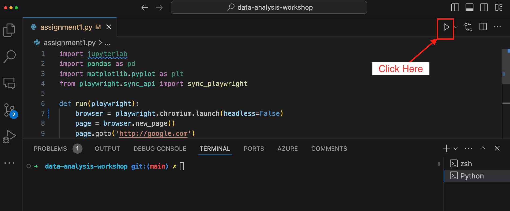

# Assignment 1: Getting Started and setting up the environment

## Step 1: Install Python
1. [Download Python installer](https://www.python.org/downloads/)
2. After the installer is downloaded, double-click the `.exe` file to run the Python installer.
3. Select the **Add python.exe to PATH** checkbox, which enables users to launch Python from the command line as shown in the screenshot below.
4. Click on install now and complete the installer.


## Step 2: Install Visual Studio Code

Download and install [Visual Studio Code](https://code.visualstudio.com/)


## Step 3: Install the following Python Packages
Open visual studio code and go to the **Terminal** menu and select **New Terminal**. Next type in the following commands to install the following packages: Jupyterlab, Pandas, Matplotlib, and Playwright. 

- Jupyterlab

```shell
pip install jupyterlab
```

- Pandas

```shell
pip install pandas
```
- Matplotlib

```shell
python -m pip install -U matplotlib
```

- Playwright

```shell
pip install playwright
```
```shell
playwright install
```

## Step 4: Create and run your Python program

- Go to Visual Studio Code, and create a new file named `assignment1.py`.
- Copy and paste the following code:

```python
import jupyterlab
import pandas as pd
import matplotlib.pyplot as plt
from playwright.sync_api import sync_playwright

def run(playwright):
    browser = playwright.chromium.launch(headless=False)
    page = browser.new_page()
    page.goto('http://google.com')
    print(page.title())
    browser.close()

with sync_playwright() as playwright:
    run(playwright)
```

- Save the file and run the program by clicking on the Run button.



## Submission

Submit a screenshot of Visual Studio Code after running the program


