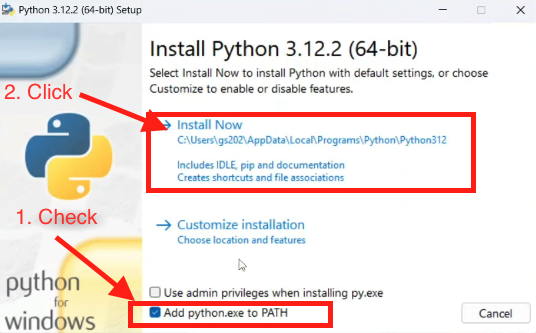

# Assignment 1: Getting Started and setting up the environment

## Step 1: Install Python
1. [Download Python installer](https://www.python.org/downloads/)
2. After the installer is downloaded, double-click the `.exe` file to run the Python installer.
3. Select the **Add python.exe to PATH** checkbox, which enables users to launch Python from the command line as shown in the screenshot below.
4. Click on install now and complete the installer.


## Step 2: Install Visual Studio Code

Download and install [Visual Studio Code](https://code.visualstudio.com/)


## Step 3: Install the following Python Packages
Open visual studio code and go to the **Terminal** menu and select **New Terminal**. Next type in the following commands to install the following packages: Jupyterlab, Pandas, Matplotlib, and Playwright. 

- Jupyterlab

```shell
pip install jupyterlab
```

- Pandas

```shell
pip install pandas
```
- Matplotlib

```shell
python -m pip install -U matplotlib
```

- Playwright

```shell
pip install playwright
```
```shell
playwright install
```

## Submission
Submit a screenshot of Visual Studio Code


